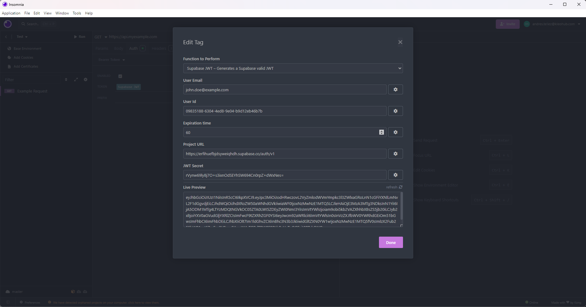

<h3 align="center">
	Generate Supabase valid JWT
</h3>

Forget about manually generating a new token every time it expires. 

With this plugin each request will have a new valid token following the standard currently supported by Supabase Auth.

----

## Installation

### From Insomnia Plugin Hub

1. Navigate to [https://insomnia.rest/plugins/insomnia-plugin-supabase-jwt-generator](https://insomnia.rest/plugins/insomnia-plugin-supabase-jwt-generator)
2. Click _Install Plugin_
3. Click _Open_
4. Once opened, click _Install_

### From the Insomnia App

1. Go to _Application_ > _Preferences_ **or** click the cog icon (⚙️)
2. Navigate to the _Plugins_ tab
3. Enter `insomnia-plugin-supabase-jwt-generator`
4. Click _Install_

### Manual Install

1. Using a terminal, `cd` into your Insomnia plugins folder - [See Insomnia Docs](https://docs.insomnia.rest/insomnia/introduction-to-plugins)
2. Run `git clone https://github.com/hatxor/insomnia-plugin-supabase-jwt-generator`

## Usage

Press Ctrl + Space to insert `<Supabase JWT>`

or type `Supabase JWT` and click on tag

This plugin uses the Fast JWT module to generate the JWT.

&nbsp;

License MIT

